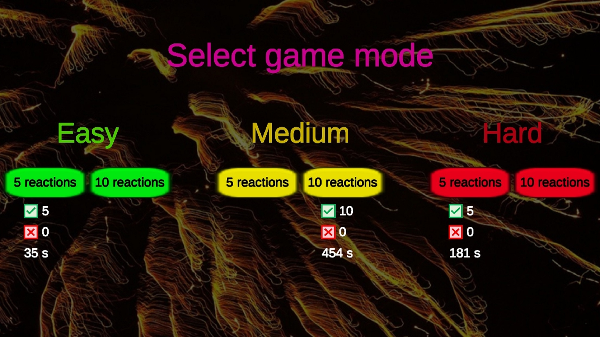
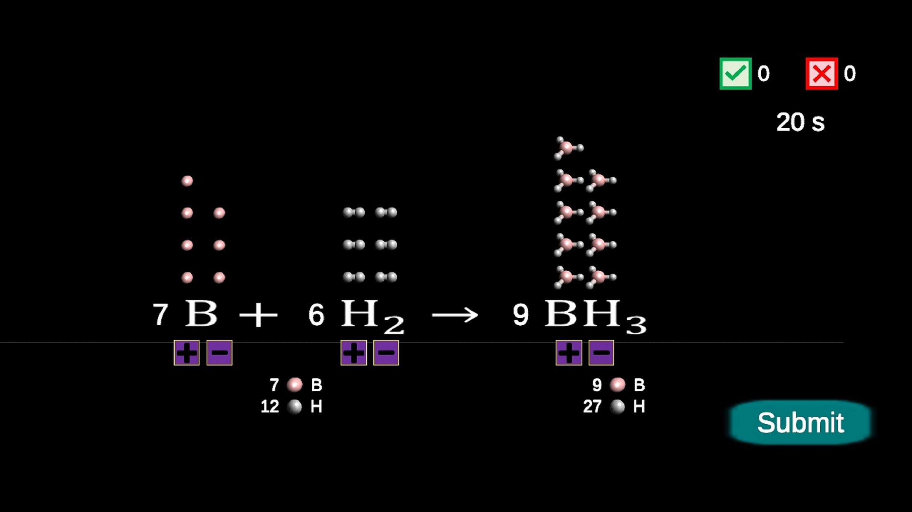
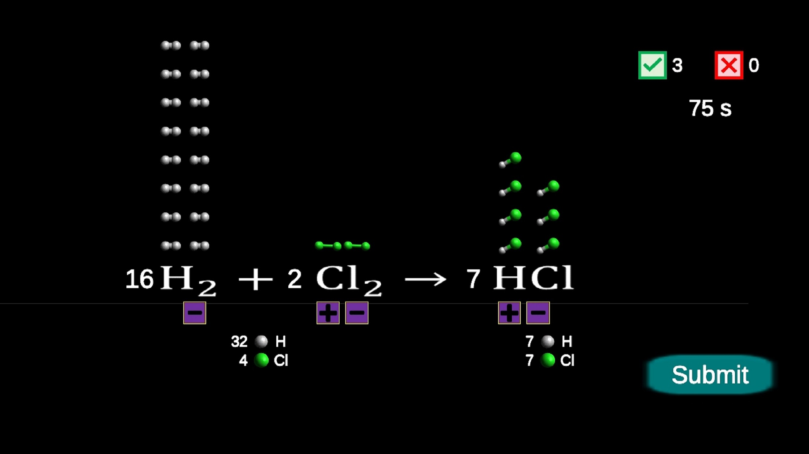
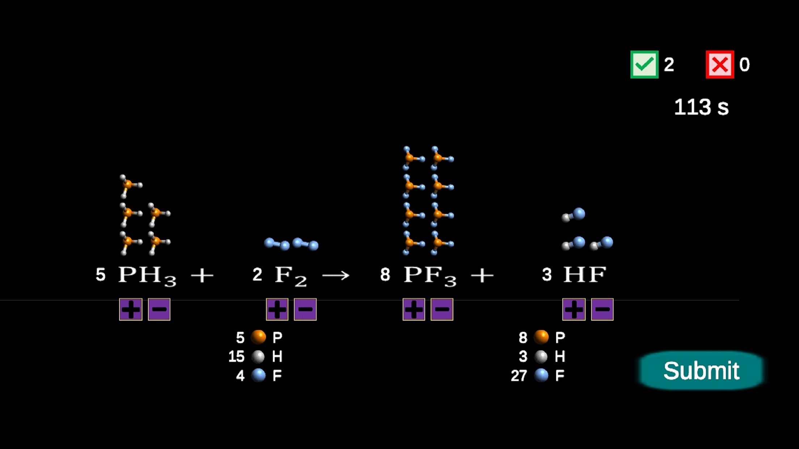
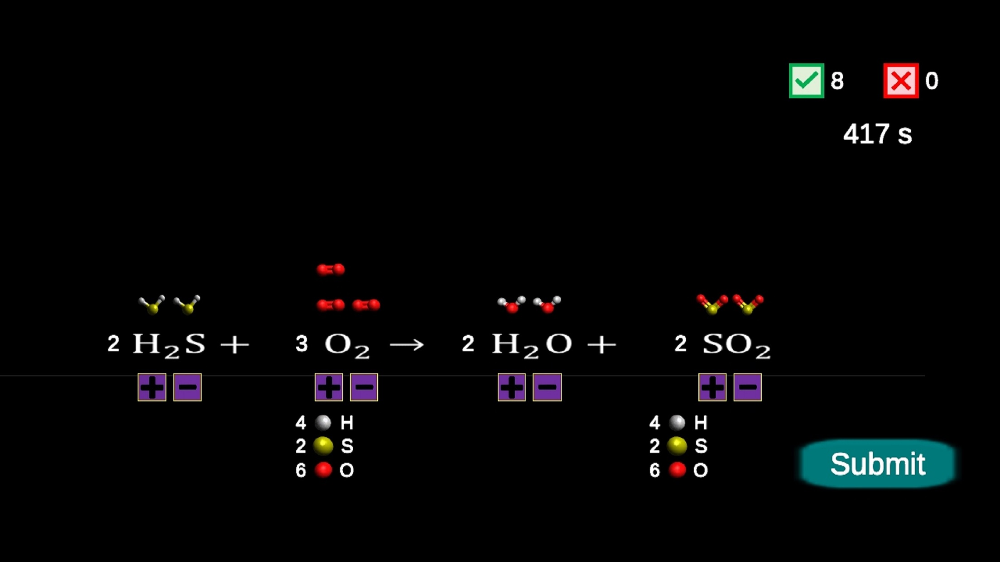
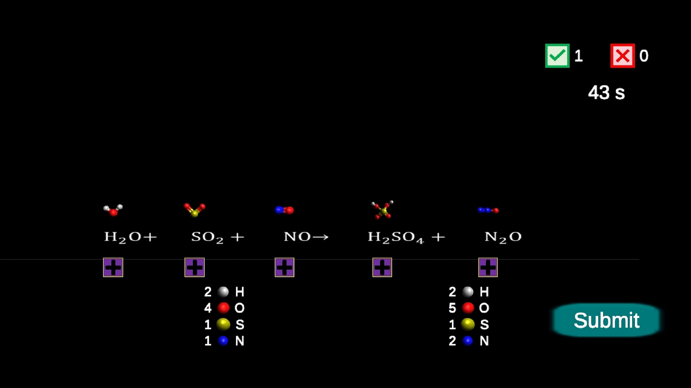
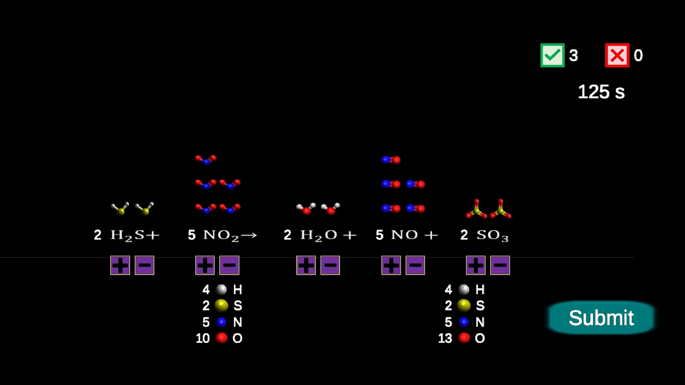

# Chemical Equations - Game

Welcome to the chemistry learning game, where you can practice balancing chemical equations in a fun and interactive way! This web-based game is designed to help students understand the fundamental principles of chemical reactions and develop their skills in balancing chemical equations.
Features

- Molecular Models: The game provides visual molecular models that facilitate the understanding and balancing of chemical equations.
- Atom Counters: Available atom counters help track the number of atoms and ensure that the chemical equation is balanced.
- Three Difficulty Levels: You can choose from three difficulty levels: easy, medium, and hard. This allows you to customize the game according to your skill level and learning needs.
- Game Length: Select the game length to be either five or ten chemical equations, so you can practice just as much as you want.

## How to Play

- Choose your desired difficulty level and game length.
- Start balancing! Use the molecular models and atom counters to assist you.
- Submit your answers.

## Objective

The goal of this game is to make learning chemistry enjoyable and interactive. Practice balancing chemical equations and enhance your chemistry skills through gameplay!

## Additional Information

If you have any questions or feedback about the game, feel free to contact the project maintainer or open an issue on GitHub.

Have fun playing and learning!

## Screenshots

## Also available for Android devices

