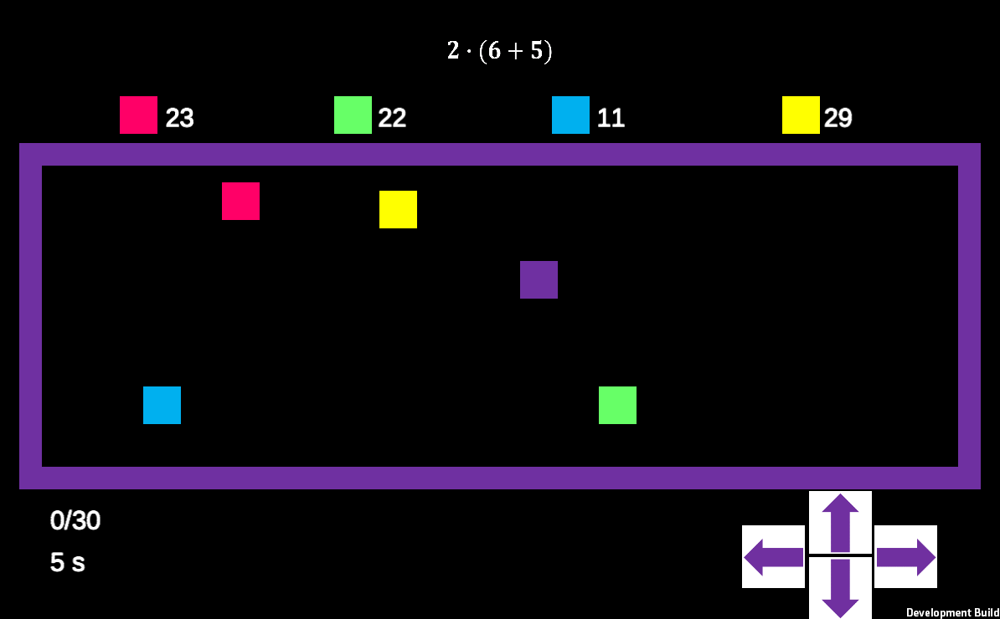

# Math Snake

Math Snake is an educational game that combines the fun of the classic Snake game with mathematical challenges. With this game, you can practice addition, subtraction, multiplication, division, and the order of operations.

## Game Description

Players are presented with a mathematical expression, and on the game board, there are four different food items that correspond to various numbers. Your task is to guide the snake to the correct food item that matches the answer to the expression.

## Levels

The game features a total of 8 challenging levels, each containing 30 math problems. As you progress through the levels, the difficulty increases, making the game even more engaging and educational.

## Losing the Game

The game ends if the snake collides with the wrong food item or the edge of the game board. Stay sharp and use your math skills to conquer all the levels!

## Features

- Practice basic arithmetic: addition, subtraction, multiplication, and division
- 8 unique levels
- 30 math problems in each level
- Fun and addictive gameplay mechanics

Welcome to play and enhance your math skills in Math Snake!

## Screenshots

## Also available for Android devices

